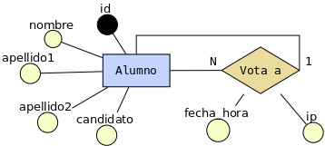

# bd-practicas-lamp

>IES Celia Viñas (Almería) - Curso 2020/2021  
>Módulo: BD - Bases de Datos  
>Ciclo: CFGS Desarrollo de Aplicaciones Web  

Aplicaciones sencillas para hacer prácticas con el stack [LAMP][lamp]. Estas prácticas consisten en sistemas **muy básicos** para añadir, editar, borrar y ver registros de una base de datos, haciendo uso de [PHP][php] y [MySQL][mysql].

# Ejemplos

## Delegado

Desarrolle una aplicación web sencilla en [PHP][1] que permita elegir el delegado de clase. La aplicación consta de los siguientes requisitos técnicos:

* El lenguaje de programación utilizado para acceder a la base de datos será [PHP][1].
* Hará uso de [Bootstrap][2], una librería *open source* de componentes HTML y CSS.

Los requisitos funcionales de la aplicación son los siguientes:

* Se mostrará una página inicial con el listado de **todos los alumnos de la clase**.
* Desde la página inicial cada alumno seleccionará su nombre de alumno y simulará que hace *login* en la aplicación para pasar a la siguiente página. 
* Una vez que un alumno hace *login* le aparece el listado de todos **los alumnos que se han ofrecido como candidatos**. Y podrá seleccionar el nombre del alumno que desea votar.
* Una vez realizada la votación el alumno puede consultar el **listado con el resultado de las votaciones**.
* Los datos que se guardan de cada alumno son el nombre, los dos apellidos y si se ofrece como candidato o no, para ser delegado.
* También habrá que guardar el voto que ha elegido cada alumno, la fecha/hora y desde que dirección IP realizó la votación.

### Código fuente

Puede encontrar el código de una posible solución en el siguiente repositorio de [GitHub][3]:

* [https://github.com/josejuansanchez/bd-practicas-lamp](https://github.com/josejuansanchez/bd-practicas-lamp.git) 

### Diagrama entidad/relación



### Paso a tablas (SQL)

```SQL
CREATE DATABASE delegado CHARACTER SET utf8;

USE delegado;

CREATE TABLE alumno (
  id INTEGER UNSIGNED AUTO_INCREMENT PRIMARY KEY,
  nombre VARCHAR(50) NOT NULL,
  apellido1 VARCHAR(50) NOT NULL,
  apellido2 VARCHAR(50),
  candidato ENUM('sí','no') NOT NULL DEFAULT 'sí',
  imagen_perfil VARCHAR(512) NOT NULL,
  vota_a INTEGER UNSIGNED,
  fecha_hora_voto DATETIME,
  ip VARCHAR(15),
  FOREIGN KEY (vota_a) REFERENCES alumno(id)
) ENGINE=InnoDB DEFAULT CHARSET=utf8;
```

[lamp]: https://en.wikipedia.org/wiki/LAMP_(software_bundle)
[php]: http://www.php.net
[mysql]: https://www.mysql.com

[1]: http://www.php.net
[2]: http://getbootstrap.com
[3]: https://github.com
